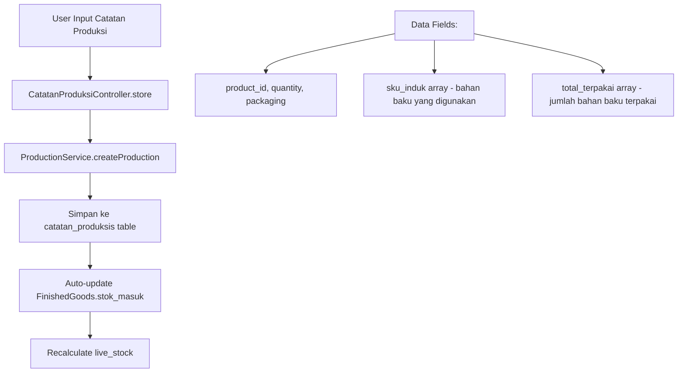
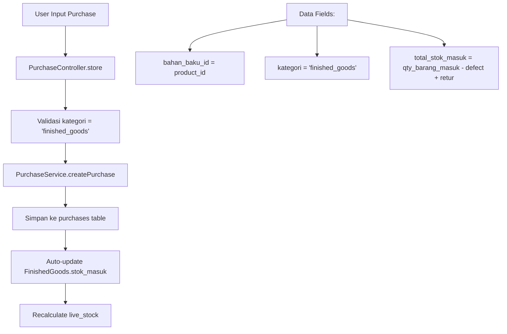
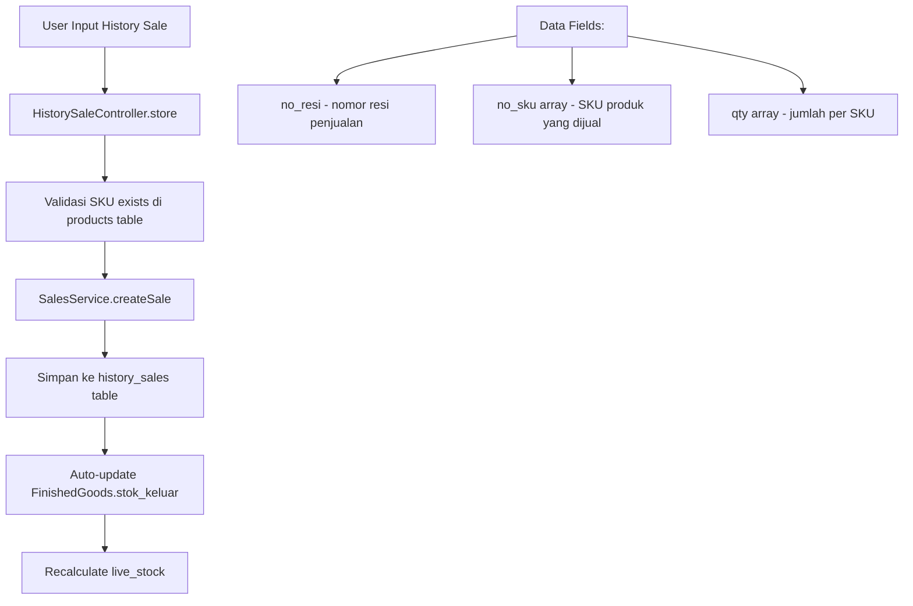
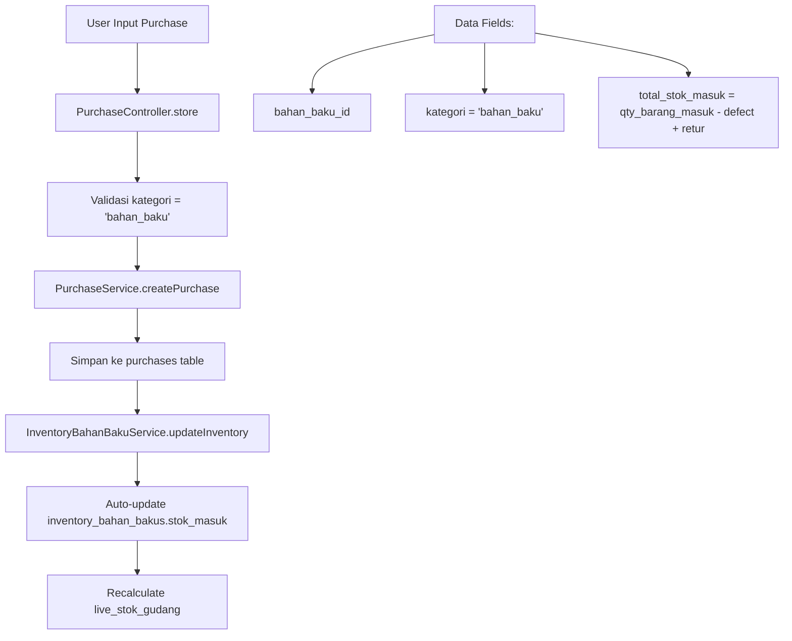
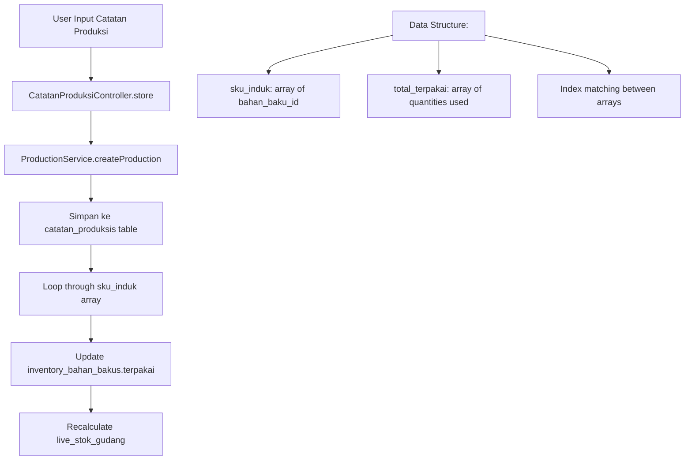
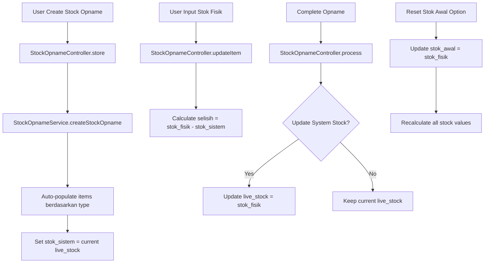
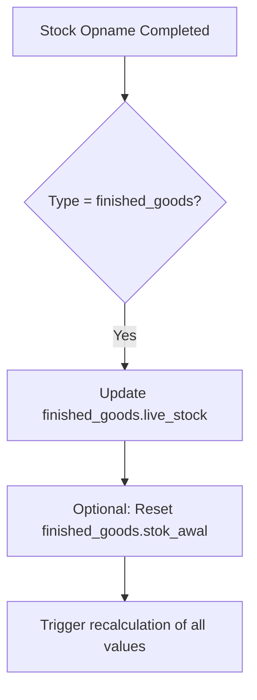
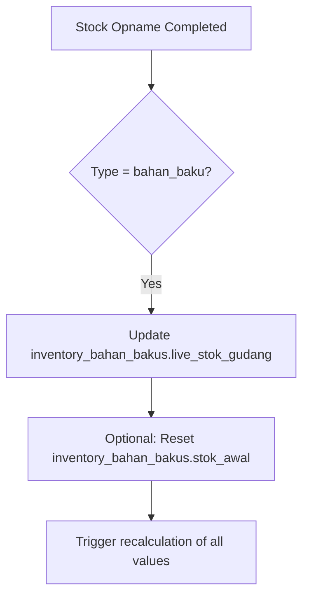
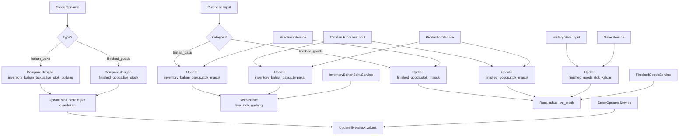

# Analisis Komprehensif Alur Data Inventory Tea Heaven

## Overview Sistem
Aplikasi Tea Heaven memiliki sistem inventory terintegrasi yang mengelola:
1. **Finished Goods** (Barang Jadi)
2. **Inventory Bahan Baku** (Raw Materials)
3. **Stock Opname** (Physical Stock Count)

---

## 1. FINISHED GOODS - Alur Data Stok Masuk & Keluar

### 📊 **Tabel Database: `finished_goods`**
```sql
- product_id (FK ke products)
- stok_awal (manual input)
- stok_masuk (dari produksi + purchase)
- stok_keluar (dari penjualan)
- defective (manual input)
- live_stock (calculated: stok_awal + stok_masuk - stok_keluar - defective)
```

### 🔄 **STOK MASUK Finished Goods**

#### **Sumber 1: Catatan Produksi**


#### **Sumber 2: Purchase Finished Goods**


#### **Formula Stok Masuk:**
```
finished_goods.stok_masuk = 
    SUM(catatan_produksis.quantity WHERE product_id = X) + 
    SUM(purchases.total_stok_masuk WHERE bahan_baku_id = X AND kategori = 'finished_goods')
```

### 🔄 **STOK KELUAR Finished Goods**

#### **Sumber: History Sales (Scanner Results)**


#### **Formula Stok Keluar:**
```
finished_goods.stok_keluar = 
    SUM(qty dari history_sales WHERE no_sku contains product.sku)
```

### 📈 **Live Stock Calculation:**
```
live_stock = stok_awal + stok_masuk - stok_keluar - defective
```

---

## 2. INVENTORY BAHAN BAKU - Alur Data Stok Masuk & Keluar

### 📊 **Tabel Database: `inventory_bahan_bakus`**
```sql
- bahan_baku_id (FK ke bahan_bakus)
- stok_awal (manual input)
- stok_masuk (dari purchase)
- terpakai (dari catatan produksi)
- defect (manual input)
- live_stok_gudang (calculated: stok_awal + stok_masuk - terpakai - defect)
```

### 🔄 **STOK MASUK Bahan Baku**

#### **Sumber: Purchase Bahan Baku**


#### **Formula Stok Masuk:**
```
inventory_bahan_bakus.stok_masuk = 
    SUM(purchases.total_stok_masuk WHERE bahan_baku_id = X AND kategori = 'bahan_baku')
```

### 🔄 **STOK KELUAR (Terpakai) Bahan Baku**

#### **Sumber: Catatan Produksi**


#### **Formula Terpakai:**
```
inventory_bahan_bakus.terpakai = 
    SUM(catatan_produksis.total_terpakai[index] 
        WHERE sku_induk[index] = bahan_baku_id)
```

### 📈 **Live Stock Calculation:**
```
live_stok_gudang = stok_awal + stok_masuk - terpakai - defect
```

---

## 3. STOCK OPNAME - Sistem Penghitungan Fisik

### 📊 **Tabel Database: `stock_opnames` & `stock_opname_items`**
```sql
stock_opnames:
- type ('bahan_baku' | 'finished_goods')
- tanggal_opname
- status ('draft' | 'in_progress' | 'completed')
- created_by

stock_opname_items:
- opname_id (FK)
- item_id (bahan_baku_id atau product_id)
- item_name
- stok_sistem (dari live stock saat opname dibuat)
- stok_fisik (input manual hasil penghitungan)
- selisih (calculated: stok_fisik - stok_sistem)
```

### 🔄 **Alur Stock Opname**



### 🔄 **Integration Points Stock Opname**

#### **Dengan Finished Goods:**


#### **Dengan Inventory Bahan Baku:**


---

## 4. ACTIVITY DIAGRAM - Alur Data Lengkap



---

## 5. FITUR-FITUR KHUSUS

### 🔄 **Auto-Sync Features**
1. **Finished Goods Sync**: Otomatis update stok_masuk dari produksi + purchase
2. **Inventory Sync**: Otomatis update stok_masuk dari purchase & terpakai dari produksi
3. **Stock Consistency Check**: Verifikasi konsistensi data antar tabel
4. **Monthly Filtering**: Filter data berdasarkan bulan untuk laporan

### 🔄 **Service Layer Integration**
- **FinishedGoodsService**: Mengelola semua operasi finished goods
- **InventoryBahanBakuService**: Mengelola inventory bahan baku
- **StockOpnameService**: Mengelola stock opname operations
- **PurchaseService**: Mengelola purchase dengan auto-update inventory
- **ProductionService**: Mengelola produksi dengan auto-update inventory
- **SalesService**: Mengelola penjualan dengan auto-update stock

### 🔄 **Data Validation**
- **SKU Validation**: Semua SKU harus exist di products table
- **Purchase Calculation**: Validasi qty_barang_masuk vs defect vs retur
- **Stock Consistency**: Validasi live_stock calculations
- **Duplicate Prevention**: Validasi no_resi dan SKU duplicates

---

## 6. KESIMPULAN ALUR DATA

### **FINISHED GOODS:**
- **STOK MASUK**: Catatan Produksi + Purchase (kategori finished_goods)
- **STOK KELUAR**: History Sales (scanner results)
- **LIVE STOCK**: stok_awal + stok_masuk - stok_keluar - defective

### **INVENTORY BAHAN BAKU:**
- **STOK MASUK**: Purchase (kategori bahan_baku)
- **STOK KELUAR (Terpakai)**: Catatan Produksi (consumption)
- **LIVE STOCK**: stok_awal + stok_masuk - terpakai - defect

### **STOCK OPNAME:**
- **INTEGRATION**: Dapat update live_stock kedua jenis inventory
- **RESET CAPABILITY**: Dapat reset stok_awal berdasarkan hasil opname
- **VARIANCE ANALYSIS**: Analisis selisih antara sistem vs fisik

Sistem ini fully integrated dengan service layer untuk memastikan konsistensi data dan transaction safety.
