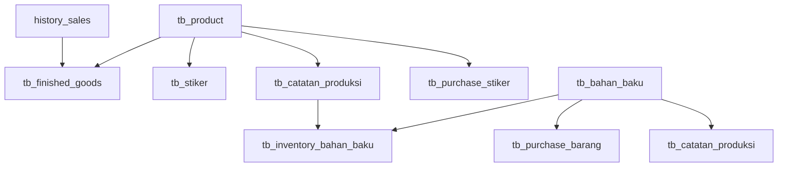

# 📦 Master Scanner Tea Heaven - Laravel Application

> **Status Aplikasi**: 🟡 **75% Complete** | **Production Ready with Critical Gaps**

## 📋 Daftar Isi

- [Overview](#-overview)
- [Status Kelengkapan](#-status-kelengkapan)
- [Fitur yang Sudah Ada](#-fitur-yang-sudah-ada)
- [Gap Analysis](#-gap-analysis)
- [Instalasi & Setup](#️-instalasi--setup)
- [Struktur Database](#-struktur-database)
- [Roadmap Development](#-roadmap-development)
- [Maintenance Guide](#-maintenance-guide)

---

## 🎯 Overview

**Master Scanner Tea Heaven** adalah sistem manajemen inventory dan produksi berbasis Laravel yang dirancang untuk mengelola:

- 🏭 **Produksi** - Catatan produksi dan penggunaan bahan baku
- 📦 **Inventory** - Manajemen stok bahan baku dan barang jadi
- 🏷️ **Sticker Management** - Pembelian dan tracking sticker produk
- 💰 **Sales** - Scanner penjualan dan history transaksi
- 👥 **User Management** - Role & permission based access control

### Tech Stack
- **Backend**: Laravel 10.x
- **Frontend**: Bootstrap 5, DataTables, Chart.js
- **Database**: MySQL
- **Authentication**: Laravel Auth + Spatie Permission
- **UI Components**: SweetAlert, Toastr

---

## 📊 Status Kelengkapan

### 🟢 **Sudah Selesai (75%)**

| **Modul** | **Status** | **Progress** | **Keterangan** |
|-----------|------------|--------------|----------------|
| User Management | ✅ Complete | 100% | Login, roles, permissions, activity log |
| Master Data | ✅ Complete | 100% | Products, Bahan Baku, Categories |
| Sales Management | ✅ Complete | 95% | Scanner, CRUD, reporting, soft delete |
| Production | ✅ Complete | 90% | Catatan produksi, material tracking |
| Finished Goods | ✅ Complete | 90% | Stock management, live calculations |
| Sticker System | ✅ Complete | 95% | Purchase, tracking, auto-status |
| Purchase Management | ✅ Complete | 85% | Bahan baku & sticker purchasing |

### 🟡 **Perlu Perbaikan (20%)**

| **Modul** | **Status** | **Priority** | **Issue** |
|-----------|------------|--------------|-----------|
| Inventory Bahan Baku | ⚠️ Partial | 🔴 CRITICAL | Model kosong, logic incomplete |
| Auto-calculations | ⚠️ Missing | 🔴 CRITICAL | Event listeners belum ada |
| Stock Integrations | ⚠️ Missing | 🟡 HIGH | Real-time updates belum terintegrasi |

### 🔴 **Belum Ada (5%)**

| **Modul** | **Status** | **Priority** | **Estimasi** |
|-----------|------------|--------------|--------------|
| Stock Bahan Baku | ❌ Missing | 🟡 MEDIUM | 2-3 hari |
| Stock Opname | ❌ Missing | 🟡 MEDIUM | 3-4 hari |
| Production Planning | ❌ Missing | 🟢 LOW | 1 minggu |
| Advanced Reporting | ❌ Missing | 🟢 LOW | 2 minggu |

---

## ✅ Fitur yang Sudah Ada

### 🔐 **User Management System**
```php
✅ Authentication & Authorization
✅ Role-based Access Control (Spatie Permission)
✅ User CRUD with permissions
✅ Activity Logging
✅ Password Reset & OTP
```

### 📊 **Master Data Management**
```php
✅ Product Management
   - SKU generation
   - Category classification
   - Packaging information
   
✅ Bahan Baku Management
   - SKU tracking
   - Unit management
   - Category system
```

### 🛒 **Sales & Scanner System**
```php
✅ Sales Scanner
   - Barcode/manual input
   - Real-time validation
   - Multiple SKU support
   
✅ Sales Management
   - CRUD operations
   - Soft delete support
   - Export functionality
   
✅ Sales Reporting
   - Date range filtering
   - Excel export
   - Data visualization
```

### 🏭 **Production Management**
```php
✅ Catatan Produksi
   - Material usage tracking (JSON)
   - Batch production recording
   - Auto-calculation gramasi
   
✅ Integration Points
   - Product selection
   - Bahan baku lookup
   - Real-time validation
```

### 📦 **Inventory System**
```php
✅ Finished Goods
   - Live stock calculation
   - Stock movement tracking
   - Auto-update from production
   
✅ Purchase Management
   - Bahan baku purchasing
   - Quality control tracking
   - Defect & return handling
   
✅ Sticker Management
   - Purchase tracking
   - Auto-status calculation
   - Integration with products
```

### 🎨 **UI/UX Features**
```php
✅ Responsive Design
✅ DataTables with server-side processing
✅ Modal-based CRUD operations
✅ SweetAlert confirmations
✅ Real-time notifications
✅ Advanced filtering & search
```

---

## ⚠️ Gap Analysis

### 🔴 **CRITICAL - Harus Diperbaiki Segera**

#### 1. **Model InventoryBahanBaku Kosong**
```php
// Current State - KOSONG TOTAL!
class InventoryBahanBaku extends Model
{
    use HasFactory;
    // Tidak ada fillable, relations, accessors!
}

// Yang Dibutuhkan:
- Fillable fields
- Relationships dengan BahanBaku
- Accessors untuk live_stok_gudang
- Scopes untuk low stock alerts
- Validation rules
```

#### 2. **Missing Database Tables**
```sql
-- Tabel yang belum ada:
❌ tb_stock_bahan_baku (referenced in documentation)
❌ tb_stock_opnames (untuk stock opname)
❌ tb_production_planning (untuk planning produksi)
```

#### 3. **Auto-calculation Logic Missing**
```php
// Event Listeners yang dibutuhkan:
❌ Sales → Auto update finished_goods.stok_keluar
❌ Production → Auto update inventory_bahan_baku.terpakai
❌ Purchase → Auto update stock levels
❌ Stock opname → Adjustment calculations
```

### 🟡 **HIGH Priority - Next Sprint**

#### 4. **Missing Controllers**
```bash
❌ StockBahanBakuController
❌ StockOpnameController  
❌ ProductionPlanningController
❌ LowStockAlertController
```

#### 5. **Integration Gaps**
```php
❌ Real-time stock level synchronization
❌ Material usage auto-deduction
❌ Low stock alert system
❌ Automatic reorder points
```

### 🟢 **MEDIUM Priority - Future Enhancement**

#### 6. **Advanced Features**
```php
❌ Forecasting & demand planning
❌ Material optimization algorithms
❌ Advanced analytics & reporting
❌ API endpoints for mobile app
❌ Barcode generation system
```

---

## ⚙️ Instalasi & Setup

### Prerequisites
```bash
- PHP 8.1+
- Composer
- Node.js & NPM
- MySQL 8.0+
- Web Server (Apache/Nginx)
```

### Installation Steps

1. **Clone Repository**
```bash
git clone <repository-url>
cd Master-Scanner-Tea-Heaven
```

2. **Install Dependencies**
```bash
composer install
npm install
```

3. **Environment Setup**
```bash
cp .env.example .env
php artisan key:generate
```

4. **Database Configuration**
```env
DB_CONNECTION=mysql
DB_HOST=127.0.0.1
DB_PORT=3306
DB_DATABASE=tea_heaven
DB_USERNAME=your_username
DB_PASSWORD=your_password
```

5. **Run Migrations & Seeders**
```bash
php artisan migrate
php artisan db:seed
```

6. **Build Assets**
```bash
npm run build
# or for development
npm run dev
```

7. **Storage Link**
```bash
php artisan storage:link
```

8. **Start Development Server**
```bash
php artisan serve
```

### Default Admin Access
```
Email: admin@example.com
Password: password
```

---

## 🗄️ Struktur Database

### **Core Tables (Implemented)**

#### Master Data
```sql
✅ tb_product           - Product master data
✅ tb_bahan_baku        - Raw materials master
✅ categories           - Product/material categories
```

#### Transactions
```sql
✅ tb_catatan_produksi  - Production records
✅ history_sales        - Sales transactions
✅ tb_purchase_barang   - Raw material purchases
✅ tb_purchase_stiker   - Sticker purchases
```

#### Inventory
```sql
✅ tb_finished_goods    - Finished goods stock
✅ tb_stiker           - Sticker inventory
⚠️ tb_inventory_bahan_baku - Raw material inventory (model incomplete)
```

#### System
```sql
✅ users               - User accounts
✅ roles               - User roles
✅ permissions         - System permissions
✅ activities          - Activity logging
```

### **Missing Tables**

```sql
❌ tb_stock_bahan_baku     - Raw material stock history
❌ tb_stock_opnames        - Stock opname records
❌ tb_production_planning  - Production planning
```

### **Key Relationships**



---

## 🛣️ Roadmap Development

### **Phase 1: Critical Fixes (1-2 weeks)**
```php
🔴 Priority 1 - Fix Critical Issues
├── Complete InventoryBahanBaku model
├── Implement auto-calculation logic
├── Create missing migrations
├── Fix integration between modules
└── Add real-time stock updates
```

### **Phase 2: Missing Features (3-4 weeks)**
```php
🟡 Priority 2 - Add Missing Modules
├── Stock Bahan Baku management
├── Stock Opname system
├── Production Planning module
├── Low Stock Alert system
└── Advanced reporting features
```

### **Phase 3: Enhancement (4-6 weeks)**
```php
🟢 Priority 3 - Advanced Features
├── Forecasting & analytics
├── Material optimization
├── Mobile app API
├── Barcode generation
├── Advanced workflows
└── Performance optimization
```

### **Phase 4: Scale & Optimize (Ongoing)**
```php
📈 Continuous Improvement
├── Performance monitoring
├── Security hardening
├── User feedback implementation
├── Feature refinements
└── Documentation updates
```

---

## 🔧 Maintenance Guide

### **Daily Monitoring**
```bash
# Check application health
php artisan schedule:work

# Monitor logs
tail -f storage/logs/laravel.log

# Database backup
php artisan backup:run
```

### **Weekly Tasks**
```bash
# Update dependencies
composer update
npm update

# Clear caches
php artisan optimize:clear

# Database maintenance
php artisan telescope:prune
```

### **Monthly Tasks**
```bash
# Security updates
composer audit
npm audit

# Performance review
php artisan route:cache
php artisan config:cache
php artisan view:cache
```

### **Key Commands**
```bash
# Development
php artisan serve
npm run dev

# Production
php artisan optimize
php artisan migrate --force

# Debugging
php artisan tinker
php artisan telescope:install
```

---

## 📞 Support & Contact

### **Development Team**
- **Backend**: Laravel + MySQL
- **Frontend**: Bootstrap + DataTables + jQuery
- **DevOps**: Apache/Nginx deployment

### **Getting Help**
1. Check existing documentation
2. Review TODO.md for known issues
3. Check Laravel logs in `storage/logs/`
4. Contact development team

### **Contributing**
1. Follow PSR-12 coding standards
2. Write tests for new features
3. Update documentation
4. Submit pull requests with clear descriptions

---

## 📄 License

This project is proprietary software for Tea Heaven operations.

---

**Last Updated**: January 2025  
**Version**: 1.0.0-beta  
**Status**: 🟡 Production Ready with Critical Gaps 