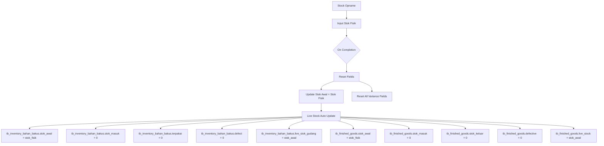

# 🔄 Stock Opname Reset Flow - Implementation Guide

## 📋 Overview

Dokumen ini menjelaskan bagaimana **stok fisik dari Stock Opname** digunakan untuk **reset penuh** pada modul **Inventory Bahan Baku** dan **Finished Goods**.  

Setelah opname disimpan dengan status `completed`, maka stok sistem akan **digantikan sepenuhnya** oleh stok fisik, dengan field lain direset ke default.

---

## 🎯 Data Flow Architecture



---

## 🔧 Reset Logic Configuration

### **Inventory Bahan Baku**

| Field | Behavior |
|-------|-----------|
| `stok_awal` | Replace → **set ke stok_fisik opname** |
| `stok_masuk` | Reset → **0** |
| `terpakai` | Reset → **0** |
| `defect` | Reset → **0** |
| `live_stok_gudang` | **Recalculate** = `stok_awal` |

---

### **Finished Goods**

| Field | Behavior |
|-------|-----------|
| `stok_awal` | Replace → **set ke stok_fisik opname** |
| `stok_masuk` | Reset → **0** |
| `stok_keluar` | Reset → **0** |
| `defective` | Reset → **0** |
| `live_stock` | **Recalculate** = `stok_awal` |

---

## 📝 Process Scenarios

### **Scenario A: Stock Opname Completed**
```yaml
Trigger: opname.status = completed
Actions:
  - Replace stok_awal = stok_fisik
  - Reset all movement fields to 0
  - Recalculate live stock = stok_awal
```

### **Scenario B: Draft / In Progress**
```yaml
Trigger: opname.status = draft/in_progress
Actions:
  - No update applied to inventory tables
  - Data hanya tersimpan di stock_opname_items
```

---

## 📊 Impact Analysis

- ✅ Semua perhitungan stok menjadi **clean slate** setelah opname
- ✅ Mengurangi risiko selisih akumulatif dari stok lama
- ✅ Memastikan live stock = hasil opname terakhir
- ⚠️ Semua histori `stok_masuk`, `stok_keluar`, `defect`, `terpakai` **hilang setelah reset**

---

## 🚀 Implementation Steps

1. **Update Service**: Tambahkan fungsi `resetFromOpname()` di `StockOpnameService.php`.
2. **Mapping**: Pastikan mapping `item_id` → `bahan_baku_id` atau `product_id` sesuai type opname.
3. **Apply Reset**: Jalankan logic di atas saat opname berubah status ke `completed`.
4. **Audit Trail**: Simpan log setiap kali reset terjadi (`stock_adjustments`).

---
