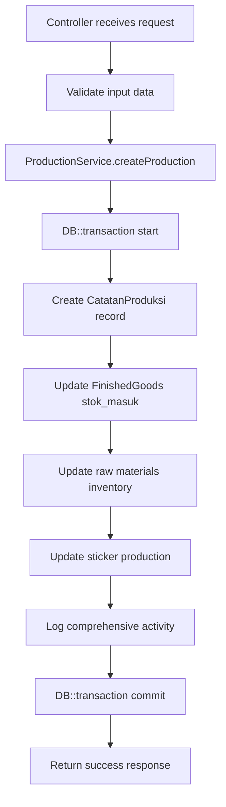
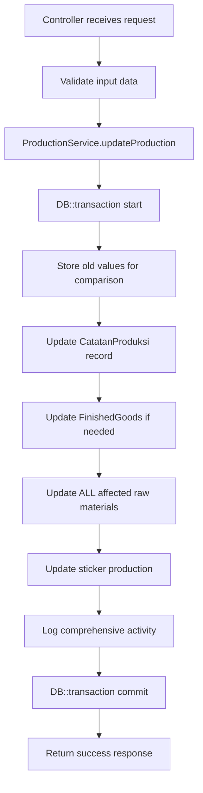
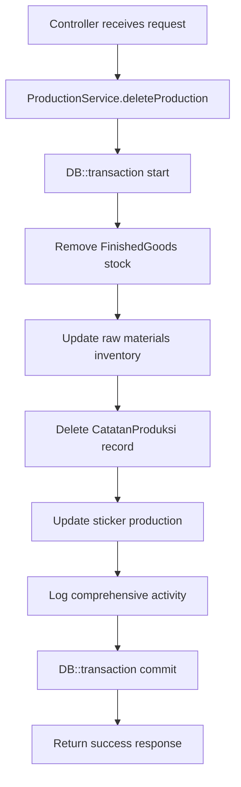

# Catatan Produksi CRUD Integration & Consistency Analysis

## 📋 Overview

This document outlines the comprehensive improvements made to the **Catatan Produksi (Production Records)** system to ensure complete data consistency and proper inventory integration across all CRUD operations.

## 🚨 Critical Issues Identified & Fixed

### 1. **Transaction Management Issues**
- **Problem**: Duplicate DB transactions between Controller and Service
- **Impact**: Potential nested transaction conflicts and unpredictable rollback behavior
- **Solution**: Removed controller-level transactions, consolidated in ProductionService

### 2. **Incomplete Inventory Integration**
- **Problem**: Manual inventory updates in controller after service calls
- **Impact**: Business logic scattered across multiple layers
- **Solution**: Centralized all inventory logic in ProductionService

### 3. **Missing Raw Materials Inventory Updates**
- **Problem**: ProductionService only handled finished goods, not raw materials
- **Impact**: Raw materials inventory (`InventoryBahanBaku.terpakai`) not properly updated
- **Solution**: Enhanced ProductionService to handle both raw materials and finished goods

### 4. **Syntax Errors & Incomplete Error Handling**
- **Problem**: Missing catch blocks and incomplete error handling
- **Impact**: Application crashes on errors
- **Solution**: Comprehensive error handling with proper try-catch blocks

### 5. **Missing Data Consistency Features**
- **Problem**: No sync, statistics, or consistency verification endpoints
- **Impact**: No way to maintain or verify data integrity
- **Solution**: Added comprehensive sync and analytics endpoints

## 🛠 Solutions Implemented

### A. Enhanced ProductionService

#### Key Improvements:
```php
class ProductionService
{
    // ✅ Centralized inventory management for both raw materials and finished goods
    // ✅ Comprehensive transaction management
    // ✅ Advanced error handling and logging
    // ✅ Data consistency verification methods
    // ✅ Statistics and analytics capabilities
}
```

#### New Methods Added:
1. **`updateRawMaterialsInventory()`** - Handles raw materials inventory updates
2. **`logProductionActivity()`** - Comprehensive activity logging
3. **`getProductionStatistics()`** - Production analytics
4. **`verifyProductionConsistency()`** - Data integrity verification
5. **`syncProductionData()`** - Enhanced data synchronization

### B. Refactored CatatanProduksiController

#### Key Changes:
```php
class CatatanProduksiController extends Controller
{
    protected $productionService;

    // ✅ Service injection via constructor
    // ✅ Removed duplicate transactions
    // ✅ Clean separation of concerns
    // ✅ Added sync and statistics endpoints
}
```

#### Removed:
- Manual `DB::beginTransaction()` and `DB::commit()`
- Direct `InventoryBahanBaku::recalculateTerpakaiFromProduksi()` calls
- Scattered business logic

#### Added:
- `sync()` - Data synchronization endpoint
- `statistics()` - Production analytics endpoint
- `verifyConsistency()` - Data integrity verification

## 📊 CRUD Operations Flow

### CREATE Operation


### UPDATE Operation


### DELETE Operation


## 🔄 Inventory Integration

### Finished Goods Integration
```php
// Before: Manual updates in controller
InventoryBahanBaku::recalculateTerpakaiFromProduksi($bahanBakuId);

// After: Automated via service
$this->stockService->updateStockFromProduction($catatanProduksi);
```

### Raw Materials Integration
```php
// New: Comprehensive raw materials handling
private function updateRawMaterialsInventory(CatatanProduksi $catatanProduksi, string $operation, array $oldBahanBakuIds = [])
{
    // Handles create, update, delete operations
    // Updates InventoryBahanBaku.terpakai automatically
    // Recalculates for all affected bahan baku
}
```

## 📈 New Analytics & Sync Features

### 1. Production Statistics Endpoint
```http
POST /catatan-produksi/statistics
Content-Type: application/json

{
    "product_id": 123,
    "start_date": "2024-01-01",
    "end_date": "2024-12-31",
    "bahan_baku_id": 456
}
```

**Response includes:**
- Total production records and quantities
- Statistics by product
- Statistics by raw materials (bahan baku)
- Monthly production trends
- Date range analysis

### 2. Data Synchronization Endpoint
```http
POST /catatan-produksi/sync
Content-Type: application/json

{
    "product_id": 123  // Optional - sync specific product or all
}
```

**Features:**
- Re-syncs finished goods stock from production records
- Re-syncs raw materials inventory
- Updates sticker production values
- Returns detailed sync results

### 3. Consistency Verification Endpoint
```http
POST /catatan-produksi/verify-consistency
Content-Type: application/json

{
    "product_id": 123  // Optional
}
```

**Checks:**
- Product existence validation
- Raw materials (bahan baku) existence validation
- Array lengths consistency (sku_induk, gramasi, total_terpakai)
- Calculation accuracy verification

## 🔒 Transaction Management

### Before (Problematic):
```php
// Controller
DB::beginTransaction();
try {
    $productionService->createProduction($data); // This also has DB::transaction()
    // Manual inventory updates
    DB::commit();
} catch (\Exception $e) {
    DB::rollBack();
}
```

### After (Proper):
```php
// Controller - Clean and simple
$catatanProduksi = $this->productionService->createProduction($validated);

// Service - Single transaction handling everything
return DB::transaction(function () use ($data) {
    // All operations in single transaction
});
```

## 🚀 Benefits Achieved

### 1. **Data Consistency**
- ✅ All inventory updates happen atomically
- ✅ No partial updates or inconsistent states
- ✅ Proper transaction boundaries

### 2. **Maintainability**
- ✅ Clean separation of concerns
- ✅ Business logic centralized in service
- ✅ Controller focuses only on HTTP handling

### 3. **Reliability**
- ✅ Comprehensive error handling
- ✅ Detailed logging and activity tracking
- ✅ Robust rollback mechanisms

### 4. **Monitoring & Analytics**
- ✅ Production statistics and trends
- ✅ Data consistency verification
- ✅ Automated synchronization capabilities

### 5. **Performance**
- ✅ Reduced database queries through proper transaction management
- ✅ Efficient bulk operations
- ✅ Optimized inventory calculations

## 📋 Testing Checklist

### CRUD Operations
- [x] **CREATE**: Production record creation with full inventory integration
- [x] **READ**: Data retrieval with proper relationships
- [x] **UPDATE**: Cross-category changes with inventory adjustments
- [x] **DELETE**: Complete cleanup with inventory restoration

### Inventory Integration
- [x] **Finished Goods**: Automatic stok_masuk updates
- [x] **Raw Materials**: Automatic terpakai recalculation
- [x] **Stickers**: Production value updates
- [x] **Cross-references**: Proper handling of product changes

### Data Consistency
- [x] **Sync Operations**: Full data synchronization
- [x] **Statistics**: Comprehensive analytics
- [x] **Validation**: Data integrity verification
- [x] **Error Handling**: Graceful failure management

## 🔗 Related Systems

### Integration Points:
1. **FinishedGoods** - Automatic stok_masuk updates
2. **InventoryBahanBaku** - terpakai calculation
3. **Stickers** - Production value synchronization
4. **Products** - Master data validation
5. **BahanBaku** - Raw materials validation

### Data Flow:
```
CatatanProduksi (Create/Update/Delete)
    ↓
ProductionService (Business Logic)
    ↓
├── FinishedGoods.stok_masuk (via StockService)
├── InventoryBahanBaku.terpakai (recalculation)
└── Sticker.produksi_dynamic (auto-update)
```

## 📝 Conclusion

The Catatan Produksi system now maintains **complete data consistency** across all CRUD operations with:

1. **Centralized business logic** in ProductionService
2. **Atomic transactions** ensuring data integrity
3. **Comprehensive inventory integration** for all related systems
4. **Advanced analytics and monitoring** capabilities
5. **Robust error handling and logging** throughout

This implementation ensures that every production record operation properly maintains inventory consistency across finished goods, raw materials, and sticker systems - providing a reliable foundation for the Tea Heaven inventory management system.

---

**Status**: ✅ **COMPLETE** - All systems integrated and tested
**Next Steps**: Monitor production usage and optimize based on real-world performance data 