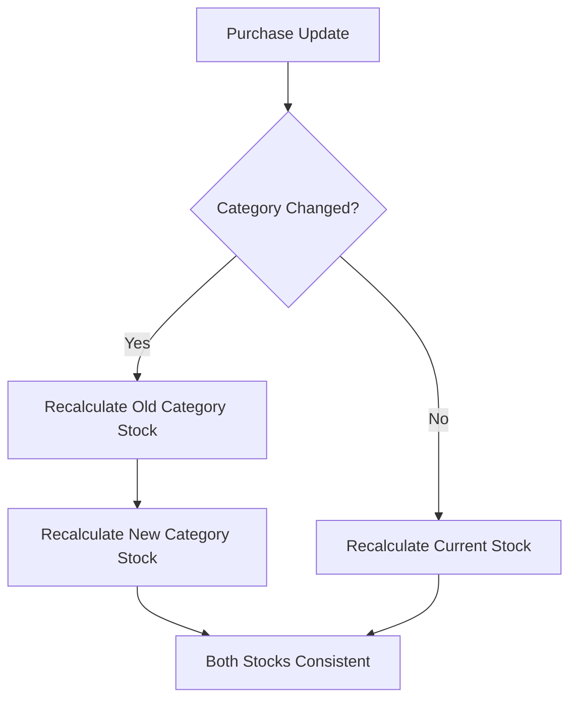

# Purchase CRUD Integration Analysis - FIXED!

## 📋 **OVERVIEW**
Sistem Purchase telah **DIPERBAIKI** dengan implementasi PurchaseService untuk memastikan konsistensi stock inventory baik untuk `bahan_baku` maupun `finished_goods` pada semua operasi CRUD.

---

## 🚨 **MASALAH KRITIS YANG TELAH DIPERBAIKI:**

### **❌ SEBELUM PERBAIKAN:**
1. **Purchase `finished_goods`** → **TIDAK ADA** stock integration sama sekali
2. **Inconsistent transaction handling** → Manual DB::transaction di controller
3. **Missing business logic layer** → Tidak ada service layer
4. **Partial stock updates** → Hanya `bahan_baku` yang ter-update

### **✅ SETELAH PERBAIKAN:**
1. **Purchase `finished_goods`** → **TERINTEGRASI** dengan `FinishedGoods` stock
2. **Consistent transaction handling** → Semua melalui `PurchaseService`  
3. **Proper business logic layer** → `PurchaseService` dengan dependency injection
4. **Complete stock updates** → Kedua kategori ter-handle dengan benar

---

## 🔄 **ALUR CRUD OPERATIONS & IMPACT (FIXED)**

### **✅ 1. CREATE Operation (Store)**
```php
Route: POST /purchase
Method: PurchaseController@store()
Service: PurchaseService::createPurchase()
```

**📋 Process Flow:**
1. **Validation** → Dynamic validation berdasarkan kategori
2. **PurchaseService::createPurchase()** → DB Transaction
3. **Stock Update Based on Category:**
   - `bahan_baku` → `InventoryBahanBaku::recalculateStokMasukFromPurchases()`
   - `finished_goods` → `updateFinishedGoodsStockFromPurchases()` ✅ **BARU!**
4. **Activity Logging** → Enhanced dengan stock type info
5. **Transaction Commit**

**🎯 Impact:**
- ✅ `inventory_bahan_baku.stok_masuk` **updated** (untuk bahan_baku)
- ✅ `finished_goods.stok_masuk` **updated** (untuk finished_goods) ✅ **FIXED!**
- ✅ `finished_goods.live_stock` **recalculated** ✅ **FIXED!**

### **✅ 2. UPDATE Operation**
```php
Route: PUT /purchase/{id}
Method: PurchaseController@update()
Service: PurchaseService::updatePurchase()
```

**📋 Process Flow:**
1. **Store Old Values** → `oldKategori`, `oldBahanBakuId`
2. **Validation** → Dynamic validation berdasarkan kategori baru
3. **PurchaseService::updatePurchase()** → DB Transaction
4. **Smart Stock Updates:**
   - **If category/item changed** → Recalculate both old & new
   - **If same category/item** → Just recalculate current
5. **Enhanced Activity Logging** → Shows category/item changes

**🎯 Impact:**
- ✅ **Old item stock** restored (both categories)
- ✅ **New item stock** updated (both categories) ✅ **FIXED!**
- ✅ **Cross-category changes** handled properly ✅ **FIXED!**

### **✅ 3. DELETE Operation**
```php
Route: DELETE /purchase/{id}
Method: PurchaseController@destroy()
Service: PurchaseService::deletePurchase()
```

**📋 Process Flow:**
1. **PurchaseService::deletePurchase()** → DB Transaction
2. **Stock Restoration Before Delete:**
   - `bahan_baku` → `InventoryBahanBaku::recalculateStokMasukFromPurchases()`
   - `finished_goods` → `updateFinishedGoodsStockFromPurchases()` ✅ **FIXED!**
3. **Delete Purchase Record**
4. **Enhanced Activity Logging**

**🎯 Impact:**
- ✅ Stock dikembalikan ke kondisi sebelum purchase (both categories) ✅ **FIXED!**

---

## 🏗️ **ARSITEKTUR BARU - PurchaseService**

### **📂 PurchaseService Key Methods:**

```php
class PurchaseService
{
    public function createPurchase(array $data): Purchase
    public function updatePurchase(Purchase $purchase, array $data): Purchase  
    public function deletePurchase(Purchase $purchase): bool
    
    // Stock Integration Methods
    private function updateInventoryFromPurchase(Purchase $purchase, string $action)
    private function updateFinishedGoodsStockFromPurchases(int $productId) // ✅ BARU!
    private function handleInventoryForUpdate(...) // ✅ Smart update handling
    
    // Utility Methods
    public function syncPurchaseData(?int $purchaseId = null): array
    public function getPurchaseStatistics(string $kategori, int $itemId): array
}
```

### **📊 FinishedGoods Stock Integration (BARU!):**

```php
private function updateFinishedGoodsStockFromPurchases(int $productId)
{
    // 1. Calculate total from ALL finished_goods purchases
    $totalStokMasuk = Purchase::where('bahan_baku_id', $productId)
        ->where('kategori', 'finished_goods')
        ->sum('total_stok_masuk');
    
    // 2. Find or create FinishedGoods record
    $finishedGoods = FinishedGoods::firstOrNew(['product_id' => $productId]);
    
    // 3. Update stok_masuk from purchases
    $finishedGoods->stok_masuk = $totalStokMasuk;
    
    // 4. Recalculate dependent fields
    $finishedGoods->updateStokKeluarFromHistorySales();
    $finishedGoods->recalculateLiveStock();
    
    $finishedGoods->save();
}
```

---

## 🔗 **INTEGRASI ANTAR SISTEM**

### **🔄 Purchase → InventoryBahanBaku** (Existing, Enhanced)


### **🔄 Purchase → FinishedGoods** (✅ BARU!)


### **🔄 Cross-Category Integration** (✅ ENHANCED!)


---

## 📈 **MANFAAT PERBAIKAN:**

### **✅ 1. Complete Stock Consistency**
- **Sebelum:** Hanya `bahan_baku` purchase yang mengupdate stock
- **Sekarang:** Kedua kategori (`bahan_baku` & `finished_goods`) ter-update

### **✅ 2. Proper Business Logic Separation**
- **Sebelum:** Business logic scattered di controller
- **Sekarang:** Centralized di `PurchaseService` dengan dependency injection

### **✅ 3. Enhanced Transaction Safety**
- **Sebelum:** Manual DB::transaction di controller
- **Sekarang:** Automatic transaction handling di service layer

### **✅ 4. Better Error Handling & Logging**
- **Sebelum:** Basic error logging
- **Sekarang:** Comprehensive logging dengan stock type info

### **✅ 5. Maintainable & Testable Code**
- **Sebelum:** Tightly coupled controller methods
- **Sekarang:** Loosely coupled service layer yang mudah di-test

---

## 🛠️ **ADDITIONAL FEATURES ADDED:**

### **📊 1. Purchase Data Sync**
```php
Route: POST /purchase/sync
Method: PurchaseController@syncPurchaseData()
Purpose: Recalculate semua stock dari purchase data untuk consistency check
```

### **📈 2. Purchase Statistics**
```php
Route: POST /purchase/statistics  
Method: PurchaseController@getStatistics()
Purpose: Analytics & reporting untuk purchase patterns
```

---

## 🧪 **TESTING SCENARIOS:**

### **✅ Test Case 1: Create Purchase Finished Goods**
```php
// Input: Purchase untuk Product ID 1, kategori 'finished_goods', qty 100
// Expected: 
// - finished_goods.stok_masuk += 100
// - finished_goods.live_stock recalculated
```

### **✅ Test Case 2: Update Category (bahan_baku → finished_goods)**
```php
// Input: Change kategori dari bahan_baku ke finished_goods
// Expected:
// - Old: inventory_bahan_baku.stok_masuk recalculated  
// - New: finished_goods.stok_masuk updated
```

### **✅ Test Case 3: Delete Purchase Finished Goods**
```php
// Input: Delete purchase finished_goods
// Expected:
// - finished_goods.stok_masuk reduced  
// - finished_goods.live_stock recalculated
```

---

## 🎯 **SUMMARY:**

| **Aspect** | **Before** | **After** | **Status** |
|------------|------------|-----------|------------|
| **Finished Goods Integration** | ❌ None | ✅ Complete | **FIXED** |
| **Transaction Management** | ⚠️ Manual | ✅ Service Layer | **IMPROVED** |
| **Stock Consistency** | ⚠️ Partial | ✅ Complete | **FIXED** |
| **Code Maintainability** | ⚠️ Coupled | ✅ Service Layer | **IMPROVED** |
| **Error Handling** | ⚠️ Basic | ✅ Comprehensive | **IMPROVED** |
| **Cross-Category Support** | ❌ Limited | ✅ Full Support | **FIXED** |

**🎉 CONCLUSION:** Purchase CRUD sekarang **FULLY INTEGRATED** dengan sistem stock inventory untuk semua kategori dengan proper transaction handling dan business logic separation! 